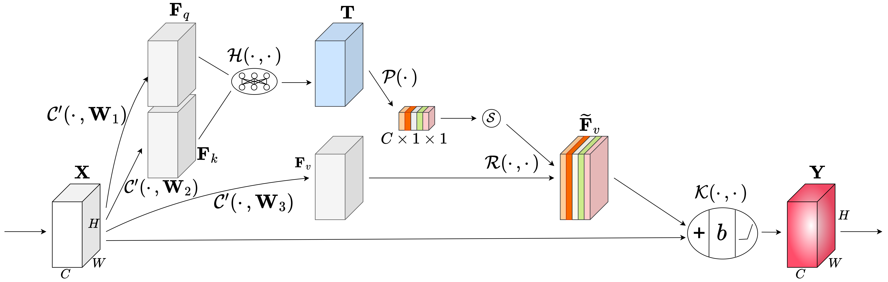

# Flat-UNet
A detailed introduction will be updated soon.

## Introduction
Flat U-Net is an efficient ultra-lightweight model designed for semantic segmentation. The model is composed of (SCA)CSA-ConvBlocks modules and presents a flattend structure.

## Getting Started

### Training
/src/fs_train.py 

### Inference
/src/fs_testing_with_gd.py

/src/fs_testing_without_gd.py